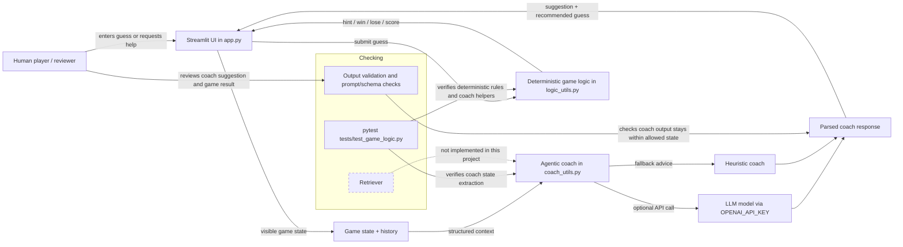

# AI System Diagram

## Flow Summary

1. The human player enters a guess or asks for help in the Streamlit UI.
2. The UI passes the visible round state and guess history into the agentic coach.
3. The coach either calls the LLM or uses the local heuristic fallback, then returns advice.
4. The same guess still goes through deterministic game logic for hints, win/loss, and score updates.
5. Tests check the pure logic and coach helpers, while the human can review the coach response in the UI.

## Notes

- **Retriever**: shown as a dashed future/optional component, but it is not implemented in the current codebase.
- **Agent**: implemented in `coach_utils.py` and wired into `app.py`.
- **Evaluator**: represented by output validation and the coach helper tests.
- **Tester**: implemented with `pytest` in `tests/test_game_logic.py`.
